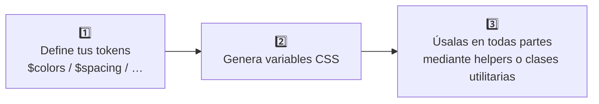

# TailorDS: Tu sistema de diseño, tus reglas

Existen muchas librerías y frameworks “listos para usar”, como Tailwind CSS, Bootstrap o Shadcn UI. Son herramientas rápidas y eficientes: con pequeños ajustes puedes tener un resultado funcional en muy poco tiempo.

Pero esa rapidez tiene un coste: te obliga a adaptarte a sus reglas, a su filosofía y a sus limitaciones. Lo que ganas en velocidad, lo pierdes en capacidad de personalización y en identidad propia. Cuanto más predefinido está todo, menos espacio queda para la creatividad, el detalle y la diferenciación.

Para muchos proyectos, ese compromiso es suficiente. Pero si tu visión es más ambiciosa —si tu producto requiere un nivel de personalización y atención al detalle que las soluciones prefabricadas no pueden ofrecer— necesitas algo diferente.

Aquí es donde nace **TailorDS**: una herramienta para quienes no aceptan un diseño en serie y prefieren crear un sistema único, a medida, sin concesiones.

## La filosofía TailorDS

Imagina que necesitas un traje. Podrías ir a una tienda y comprar uno ya hecho. Seguramente encontrarás tu talla, un diseño y un color que te gusten, y con unos pequeños ajustes te sentará bien. Es rápido y económico, pero estarás limitado a sus modelos y, seamos sinceros, llevarás el mismo traje que muchas otras personas. Eso son los frameworks tradicionales.

Ahora, piensa en un **traje hecho a medida**. Aquí, tú decides cada detalle: el diseño, los materiales, cada ajuste se realiza con precisión milimétrica. Es un proceso más artesanal, lleva más tiempo, pero el resultado es una prenda diseñada exclusivamente para ti, que satisface cada uno de tus requisitos sin concesiones. Es único.

Con TailorDS queremos que seas el artesano. No hacemos el trabajo por ti, pero te damos la metodología, las reglas y las herramientas para que construyas tu Design System mejor, más rápido y sin errores.

## Qué es TailorDS

TailorDS es una librería de herramientas y patrones diseñada para ayudar a **construir tu propio Design System** desde cero.

**TailorDS NO es:**

- Un Design System con componentes UI.
- Una plantilla con componentes predefinidos.
- Una alternativa directa a Tailwind CSS o Bootstrap.
- Un framework con reglas fijas.

**TailorDS SÍ es:**

- Un conjunto de herramientas para crear tu propio Design System.
- Un sistema flexible para definir y gestionar tus propios tokens de diseño.
- Una metodología que te permite trabajar con tus propias reglas.
- Un facilitador para mantener consistencia sin sacrificar personalización

Nuestro enfoque es claro: **potenciar la creación de Design Systems únicos y a medida.** Para nosotros, esto implica libertad total en el diseño y en la implementación, sin concesiones, y con la garantía de que tu producto tendrá un diseño propio, que no se parecerá al de otros miles que han usado los mismos frameworks.

TailorDS no toma las decisiones por ti: **tú defines las reglas, nosotros te damos las herramientas.**

## Para quién es TailorDS

TailorDS es para cualquiera que comparta la filosofía de hacer las cosas bien: cuidar cada detalle y no conformarse con un diseño “en serie”.

- **Para diseñadores:** Ofrece la libertad de plasmar sus decisiones visuales exactamente como las han concebido, sin verse condicionados por las limitaciones técnicas o metodológicas de un framework.

- **Para desarrolladores:** Proporciona un conjunto coherente de herramientas —variables, utilidades, mixins y funciones— que facilitan la implementación y el mantenimiento del Design System, garantizando consistencia y evitando errores comunes en el día a día.

- **Para CTOs y stakeholders:** Asegura que la identidad de marca se mantenga pura y que el producto final sea distintivo, sin parecerse a ningún otro.

TailorDS es para quienes buscan crear un sistema que refleje la identidad única de su producto, sin compromisos.

## Características: Potencia y flexibilidad

- **Flexibilidad ilimitada:** Define tus tokens de diseño (colores, espaciados, tipografías, etc.) con total libertad. No hay límites en cantidad, nombres o estructura. A diferencia de otros frameworks, TailorDS no te impone cómo deben ser tus bases.

- **Única fuente de verdad:** Genera automáticamente variables CSS a partir de tus tokens. Esto asegura que todos los estilos partan de una única fuente de verdad y mantengan la consistencia. Además, sus valores pueden actualizarse en tiempo de ejecución, permitiendo modificar el tema, adaptar tu diseño o adaptarse al tamaño de la pantalla.

- **Funciones y mixins type-safe:** Proporciona funciones y mixins en SCSS que garantizan el uso de tokens definidos, evitando valores no válidos o hardcoded. De este modo, todos los estilos quedan vinculados a variables CSS, mejorando la consistencia y la mantenibilidad.

- **Clases utilitarias personalizables:** Genera clases utilitarias basadas en tus tokens, con control granular sobre cuáles generar. Esto permite reducir el tamaño de las hojas de estilo y definir las convenciones de nombres que prefieras (por ejemplo `.margin-bottom-double`, `.mb2`, `.mb--xl`)

- **Metodología a tu medida:** TailorDS es agnóstico a la metodología. Te permite desarrollar con el enfoque que prefieras: utility-first (como Tailwind), clases específicas para componentes, Atomic Design o metodologías híbridas. Sea cual sea tu flujo de trabajo, TailorDS se adapta a él sin imponer un paradigma concreto. **"Tu framework, tus reglas."**

- **Independencia del stack frontend:** Al estar desarrollado para CSS/SCSS, TailorDS se integra sin problemas con cualquier framework frontend (React, Vue, Svelte, etc.).

## Cómo funciona TailorDS

TailorDS sigue un proceso de tres pasos para garantizar consistencia y flexibilidad para crear tu propio Design System:



1. **Define tus tokens:** Comienza creando tus tokens de diseño (por ejemplo, colores, tipografía, espaciados). Tienes total libertad para nombrarlos y estructurarlos como mejor se adapte a las necesidades de tu producto.
2. **Genera las variables CSS:** TailorDS convierte automáticamente tus tokens en variables CSS, que serán usadas como una única fuente de verdad para tu sistema de diseño.
3. **Desarrolla con helpers y clases utilitarias:** Usa las clases utilitarias, mixins y funciones generadas por TailorDS para aplicar tus tokens en toda tu aplicación. Estas herramientas aseguran que solo se usen tokens válidos, manteniendo la consistencia y evitando valores "mágicos", mientras aprovechan el poder de las variables CSS.

```scss
// Paso 1: Define
$colors: (
  primary: #3b82f6,
  danger: #ef4444,
);

// Paso 2: Se genera automáticamente
:root {
  --color-primary: #3b82f6;
}

// Paso 3: Usas
.button {
  background: color("primary");
}
```

## Roadmap

TailorDS seguirá evolucionando como un ecosistema completo para diseñar, mantener y documentar Design Systems. Estas son algunas de las herramientas previstas en nuestro roadmap:

- **Tema para VitePress:** Un tema para VitePress con componentes básicos para mostrar los tokens definidos (por ejemplo, paletas de colores, escalas tipográficas, unidades de espaciado) y ejemplos en vivo, para mostrar los tokens en acción, con ejemplos de código y documentar el sistema de forma clara y visual.
- **Herramientas adicionales**: Se planean herramientas como un generador de paletas de colores, creador de escalas tipográficas y otros utilitarios para agilizar la creación de las bases del sistema de diseño.
- **Guía para sistemas de diseño**: Una guía paso a paso para crear un Design System desde cero con TailorDS, con consejos y buenas prácticas.

---

¿Listo para crear un Design System único? Explora la documentación de TailorDS en [enlace] o pruébalo en tu próximo proyecto para llevar tus ideas al siguiente nivel.
