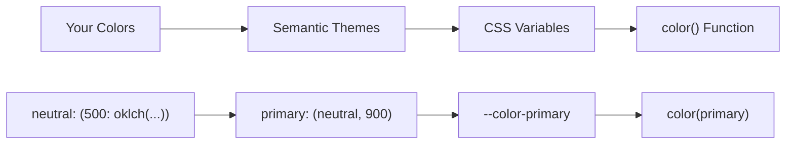

# Colors

Every time you write `background: #3b82f6`, a design system dies. TailorDS colors give you the consistency of design tokens with the flexibility of your own naming conventions.

## How It Works

TailorDS uses a three-layer system that turns your color decisions into bulletproof CSS:

<div class="architecture-flow">



</div>

The magic happens when you configure once and everything just works:

```scss
// Define your colors
$colors: (
  brand: (
    500: oklch(65% 0.15 280),
  ),
);

// Use them everywhere
.button {
  background: color(brand, 500);
}
.badge {
  background: color(brand, 500, 0.1);
} // With opacity
```

## Your Color Palette

<ColorPalette />

These aren't just pretty swatches – they're the foundation of your entire design system. Each color is defined in OKLCH color space, giving you perceptually uniform scaling and better color consistency across themes.

## Semantic Tokens

While primitive colors define _what_ colors you have, semantic tokens define _when_ to use them.

<SemanticTokens />

Notice how `color-primary` adapts between light and dark themes, but your code stays the same. That's the power of semantic tokens – they carry meaning, not just values.

## The color() Function

Your main tool for accessing colors. It's designed to be type-safe and flexible:

<ColorPlayground />

```scss
// Basic usage
color(primary)              // Semantic token
color(neutral, 500)         // Primitive with shade
color(primary, 0.8)         // With opacity

// Error handling
color(nonexistent)          // ❌ Compile error - token doesn't exist
color(neutral, 1000)        // ❌ Compile error - shade doesn't exist
```

The function is smart about detecting whether your second parameter is a shade or opacity value. Numbers ≤ 1 are treated as opacity.

## Making Colors Yours

### Quick Setup

```scss
@use "tailords" as *;

// Your colors are already defined and ready to use
.hero {
  background: color(primary);
}
```

### Custom Colors

Want your own brand colors? Just override the defaults:

```scss
@use "tailords" as * with (
  $colors: (
    // Your brand palette
    forest: (light: oklch(85% 0.05 120), base: oklch(45% 0.15 120), dark: oklch(25% 0.12 120)),

    // Keep the neutrals
    neutral: (50: oklch(98% 0 0), 500: oklch(55% 0 0), 950: oklch(15% 0 0)),
  )
);

// Now use your colors
.nature-button {
  background: color(forest, base);
  color: color(forest, light);
}
```

### Custom Semantic Tokens

Map your colors to semantic roles that make sense for your project:

```scss
@use "tailords" as * with (
  $theme: (
    // E-commerce specific tokens
    color-price: (forest, dark),
    color-sale: (red, 500),
    color-discount: (green, 600),
    // Standard tokens
    color-background: (white),
    color-foreground: (neutral, 950),
  )
);

.price {
  color: color(price);
}
.sale-badge {
  background: color(sale);
}
```

## Themes That Actually Work

### Automatic Theme Switching

<ThemeSwitcher />

TailorDS generates CSS custom properties that update automatically:

```html
<!-- Light theme (default) -->
<body>
  <div class="card">Perfectly themed</div>
</body>

<!-- Dark theme -->
<body data-theme="dark">
  <div class="card">Same markup, dark theme</div>
</body>
```

The CSS variables change, but your components don't need to know about it:

```css
/* Generated automatically */
:root {
  --color-background: oklch(1 0 0);
  --color-primary: oklch(20% 0 0);
}

[data-theme="dark"] {
  --color-background: oklch(15% 0 0);
  --color-primary: oklch(85% 0 0);
}
```

### Multiple Themes

Create as many themes as you need:

```scss
$theme-brand: (
  color-background: (
    brand,
    50,
  ),
  color-foreground: (
    brand,
    950,
  ),
  color-primary: (
    brand,
    600,
  ),
);

$theme-high-contrast: (
  color-background: (
    white,
  ),
  color-foreground: (
    black,
  ),
  color-primary: (
    blue,
    700,
  ),
);
```

```html
<body data-theme="brand">
  Brand theme
</body>
<body data-theme="high-contrast">
  Accessible theme
</body>
```

## Utility Classes

When you need quick adjustments, TailorDS generates utility classes from your exact color tokens:

```html
<!-- Uses your semantic tokens -->
<div class="bg-primary text-primary-foreground">Primary button style</div>

<!-- Uses your primitive colors -->
<div class="bg-brand-500 text-white">Specific brand color</div>

<!-- Conditional styling (great for React/Vue) -->
<button
  :class="{
  'bg-primary text-white': isActive,
  'bg-neutral-100 text-neutral-900': !isActive
}"
></button>
```

Configure exactly which utilities you want:

```scss
@use "tailords" as * with (
  $utilities: (
    colors: (
      text,
      background,
      border,
    ), // Only these utilities
  )
);
```

## Best Practices

### Use Semantic Tokens for Components

```scss
// ✅ Good - semantic and themeable
.alert {
  background: color(background);
  border: 1px solid color(border);
  color: color(foreground);
}

// ❌ Avoid - not themeable
.alert {
  background: color(neutral, 50);
  border: 1px solid color(neutral, 200);
  color: color(neutral, 900);
}
```

### Save Primitives for Special Cases

```scss
// ✅ Good use of primitives - brand-specific gradient
.hero-gradient {
  background: linear-gradient(135deg, color(brand, 400), color(brand, 600));
}
```

### Accessibility Matters

TailorDS helps you maintain good contrast ratios:

```scss
// Semantic tokens ensure proper contrast
.button {
  background: color(primary);
  color: color(primary-foreground); // Always readable
}
```

<AccessibilityIndicator />

The system automatically pairs backgrounds with appropriate foreground colors, but always test with real users and accessibility tools.

## When Things Go Wrong

### Common Errors

**Token doesn't exist:**

```scss
.broken {
  color: color(typo);
}
// Error: The color 'typo' doesn't exist
```

**Shade doesn't exist:**

```scss
.broken {
  color: color(neutral, 1000);
}
// Error: The color 'neutral-1000' doesn't exist
```

### Debugging Tips

Check what colors are available:

```scss
// In your browser dev tools, look for:
:root {
  --color-primary: /* your value */ --color-neutral-500: /* your value */;
}
```

Or add a debug class:

```scss
.debug-colors {
  &::before {
    content: "Primary: #{color(primary)}, Background: #{color(background)}";
  }
}
```

### Migration from Other Systems

Coming from magic values? Replace them gradually:

```scss
// Before
.old-button {
  background: #3b82f6;
}

// After
.new-button {
  background: color(primary);
}
```

Coming from CSS custom properties? TailorDS generates them for you:

```scss
// Before
.old-card {
  background: var(--blue-500);
}

// After
.new-card {
  background: color(blue, 500);
}
```

## Advanced Usage

### Dynamic Color Variations

```scss
.success-states {
  background: color(success);

  &:hover {
    background: color(success, 0.9);
  }
  &:active {
    background: color(success, 0.8);
  }
  &.disabled {
    background: color(success, 0.3);
  }
}
```

### Color Mixing

Combine colors for subtle effects:

```scss
.overlay {
  background: color-mix(in oklch, color(background) 90%, color(primary) 10%);
}
```

### Custom Properties for Runtime

Need to change colors at runtime? TailorDS CSS variables make it simple:

```javascript
// Change the primary color dynamically
document.documentElement.style.setProperty("--color-primary", "oklch(70% 0.15 200)");
```

---

Your colors should work _for_ you, not against you. TailorDS gives you the tools to build a color system that scales from prototype to production, adapts to any theme, and keeps your code clean and maintainable.

Ready to explore more? Check out [Typography](/foundations/typography) or dive into [Building Components](/components/).
