<div class="vp-doc homepage-content">

## How TailorDS works

TailorDS follows a simple, 3-step flow to keep your colors consistent and maintainable:

```mermaid
flowchart LR
    A["1️⃣<br>Define your tokens<br>$colors / $spacing / …"]
    B["2️⃣<br>Generate CSS variables<br>with provided mixins"]
    C["3️⃣<br>Use everywhere<br>via helpers or utility classes"]

    A --> B --> C

    style A fill:#f5f5f5,stroke:#ccc,stroke-width:1px
    style B fill:#f5f5f5,stroke:#ccc,stroke-width:1px
    style C fill:#f5f5f5,stroke:#ccc,stroke-width:1px

```



**Define once, use everywhere — and seamlessly switch themes at runtime.**

1. **Define your palette** <br>
   Declare all the tokens your system needs in the appropriate Sass map (`$colors`, `$spacing`, `$typography`, etc.). Define primitives and optionally semantic tokens for meaning.

2. **Generate CSS variables** <br>
   Use the corresponding `generate-…-variables()` mixin to turn your tokens into CSS custom properties. These variables become the runtime source of truth and enable theme switching.

3. **Use helpers and utilities** <br>
   Always use the provided helper functions or generated utility classes. They resolve to the right CSS variable, keeping your UI consistent and easy to maintain.

## Every Framework Makes You Choose

<div class="comparison-grid">

**Tailwind CSS**
Great utilities, but you're stuck with their naming and scale decisions.

**Bootstrap**
Comprehensive components, but limited customization beyond surface theming.

**Custom CSS**
Full control, but you lose utility productivity and build everything from scratch.

</div>

## TailorDS: No More Trade-offs

<div class="code-comparison">

```scss
// Your tokens, your names
$colors: (
  brand: (
    primary: oklch(65% 0.15 280),
  ),
);

// Component development (type-safe & semantic)
.hero {
  background: color(brand-primary); // ✅ Design system enforced
  padding: spacing(comfortable); // ✅ Your semantic naming
}
```

```html
<!-- Utility classes (fast & flexible) -->
<div class="bg-brand-primary p-comfortable">
  <!-- Your exact tokens as utilities -->
</div>
```

```scss
// Protection against violations
.broken {
  color: color(typo); // ❌ Compile error - token doesn't exist
}
```

</div>

## What Makes It Different

<div class="features-detailed">

### 🎨 **Your Rules, Not Ours**

Define colors called `forest-deep` or spacing tokens called `cozy`. TailorDS generates everything from your design decisions, not generic scales.

### 🔧 **Type-Safe Design Systems**

Get compile-time validation for all your design tokens. No more hunting through CSS to find where you used that random hex value.

### ⚡ **Mathematical Precision**

Built on design science principles - modular typography scales, vertical rhythm, and perceptually uniform colors in OKLCH space.

### 🌙 **Themes That Actually Work**

Zero-runtime theme switching with CSS custom properties. Same markup, different themes, no JavaScript required.

</div>

## Quick Taste

::: code-group

```scss [Simple Setup]
@use "@tailords" as *;

.button {
  background: color(primary);
  padding: spacing(2) spacing(4);
  @include text-body(sm);
}
```

```scss [Custom Setup]
@use "@tailords" as * with (
  $colors: (
    forest: (
      deep: oklch(25% 0.12 120),
    ),
  ),
  $utilities: (
    colors: (
      text,
      background,
    ),
    spacing: (
      margin,
      padding,
    ),
  )
);
```

```html [Framework Integration]
<!-- Perfect for conditional styling -->
<button
  :class="{
  'bg-primary text-white': isActive,
  'bg-neutral-100': !isActive,
  'p-comfortable': size === 'large'
}"
></button>
```

:::

## Start Building

<div class="cta-grid">

<div class="cta-card">

### 🚀 **Developers**

Jump straight into code with our quick start guide.

[Get Started →](/getting-started/)

</div>

<div class="cta-card">

### 🎨 **Designers**

Explore the design foundations and see how tokens work.

[Foundations →](/foundations/)

</div>

<div class="cta-card">

### 📦 **Components**

See real examples of building components with TailorDS.

[Components →](/components/)

</div>

</div>

---

<div class="bottom-cta">

**Ready to stop compromising?**

[Read the Documentation](/getting-started/) or [Download Figma Kit](https://figma.com/tailords-kit)

</div>

</div>

<style scoped>
.homepage-content {
  max-width: 1152px;
  margin: 0 auto;
  padding: 0 24px;
}

.comparison-grid {
  display: grid;
  grid-template-columns: repeat(auto-fit, minmax(280px, 1fr));
  gap: 2rem;
  margin: 2rem 0;
  text-align: center;
}

.comparison-grid > * {
  padding: 1.5rem;
  background: var(--vp-c-bg-soft);
  border-radius: 8px;
  border: 1px solid var(--vp-c-divider);
}

.code-comparison {
  margin: 2rem 0;
}

.code-comparison .language-scss,
.code-comparison .language-html {
  margin-bottom: 1rem;
}

.features-detailed {
  display: grid;
  grid-template-columns: repeat(auto-fit, minmax(300px, 1fr));
  gap: 2rem;
  margin: 3rem 0;
}

.features-detailed > div {
  padding: 1.5rem;
  background: var(--vp-c-bg-soft);
  border-radius: 12px;
  border: 1px solid var(--vp-c-divider);
}

.features-detailed h3 {
  margin-top: 0;
  color: var(--vp-c-brand-1);
}

.cta-grid {
  display: grid;
  grid-template-columns: repeat(auto-fit, minmax(250px, 1fr));
  gap: 2rem;
  margin: 3rem 0;
}

.cta-card {
  padding: 2rem;
  background: var(--vp-c-bg-soft);
  border-radius: 12px;
  border: 1px solid var(--vp-c-divider);
  text-align: center;
  transition: all 0.3s ease;
}

.cta-card:hover {
  border-color: var(--vp-c-brand-1);
  transform: translateY(-2px);
}

.cta-card h3 {
  margin-top: 0;
  color: var(--vp-c-brand-1);
}

.cta-card a {
  display: inline-block;
  margin-top: 1rem;
  padding: 0.5rem 1rem;
  background: var(--vp-c-brand-1);
  color: white;
  text-decoration: none;
  border-radius: 6px;
  font-weight: 500;
}

.bottom-cta {
  text-align: center;
  padding: 3rem 0;
  margin-top: 3rem;
  border-top: 1px solid var(--vp-c-divider);
}

.bottom-cta a {
  color: var(--vp-c-brand-1);
  text-decoration: none;
  font-weight: 500;
}

.bottom-cta a:hover {
  text-decoration: underline;
}

@media (max-width: 768px) {
  .comparison-grid {
    grid-template-columns: 1fr;
    gap: 1rem;
  }

  .features-detailed {
    grid-template-columns: 1fr;
    gap: 1rem;
  }

  .cta-grid {
    grid-template-columns: 1fr;
    gap: 1rem;
  }
}
</style>
