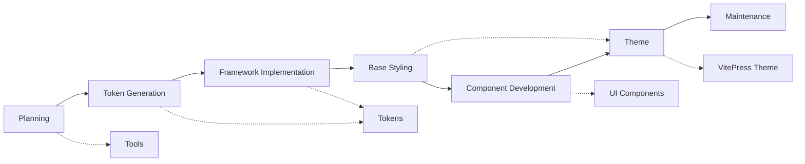

# TailorDS Ecosystem - Project Requirements Document

## 1. Vision and Philosophy

### 1.1 The Problem with Current Solutions

The frontend development ecosystem offers a false choice between speed and uniqueness:

- **Pre-built frameworks** (Tailwind CSS, Bootstrap) are fast but create homogeneous designs
- **Custom CSS** provides freedom but lacks systematic approach and consistency
- **Component libraries** accelerate development but impose design decisions
- **Design Systems** are powerful but expensive and complex to build from scratch

**The result**: Thousands of websites and applications that look identical, built with the same frameworks and design decisions.

### 1.2 The TailorDS Philosophy

> **"Your Design System, Your Rules"**

TailorDS believes that every product deserves a unique design identity. We don't provide ready-made solutions—we provide the **methodology, tools, and ecosystem** to build your own Design System that reflects your product's unique personality and requirements.

**Core Principles**:

1. **Complete Customization Freedom**: No imposed design decisions or aesthetic constraints
2. **Systematic Approach**: Structured methodology that ensures consistency and scalability
3. **Developer-Centric**: Tools designed for developers, by developers
4. **Education-First**: Teaching concepts alongside implementation
5. **Ecosystem Thinking**: Integrated tools that work seamlessly together

### 1.3 Target Audience

**Primary Users**:

- Frontend developers building custom Design Systems
- Design System teams in organizations of all sizes
- UI/UX designers who need their vision accurately translated to code
- Product teams who value brand differentiation

**Secondary Users**:

- Developers learning Design System concepts
- Teams migrating from existing frameworks
- Agencies building unique products for clients
- Open source projects needing design consistency

## 2. Ecosystem Overview

### 2.1 The Complete Design System Lifecycle

TailorDS covers the entire Design System lifecycle through an integrated ecosystem:



### 2.2 Package Architecture

The TailorDS ecosystem consists of five integrated packages:

#### **@tailords/tokens** - The Tokens

_SCSS framework for Design System creation_

- Design token management with unlimited nesting
- CSS custom properties generation
- Type-safe helper functions
- Configurable utility class generation
- Framework-agnostic implementation

#### **@tailords/studio** - The Studio

_Design System creation and optimization tools_

- Color palette generators with accessibility validation
- Typography scale calculators
- Spacing system builders
- Token conversion utilities
- Performance optimization tools

#### **@tailords/vitepress** - The Documentation

_VitePress theme for Design System documentation_

- Interactive token preview components
- Live Design System sandbox
- Automated utility class documentation
- Token browser and explorer
- Responsive design showcases

#### **@tailords/theme** - The Theme

_Opinionated HTML/CSS foundation framework_

- Cross-browser normalization and reset
- Semantic HTML element styling
- Responsive design patterns
- Accessibility best practices
- TailorDS token integration

#### **@tailords/ui** - The UI Components

_Vue.js component library built with TailorDS_

- Fully customizable Vue components
- Token-driven design implementation
- Accessibility-first development
- TypeScript support
- Storybook integration

### 2.3 Integration Benefits

**Seamless Development Experience**:

- Shared design tokens across all packages
- Consistent API patterns and conventions
- Synchronized versioning and releases
- Cross-package type safety and validation

**Complete Ecosystem**:

- No need to integrate disparate tools
- Guaranteed compatibility between components
- Unified documentation and learning resources
- Single source of truth for Design System data

## 3. Monorepo Strategy

### 3.1 Why Monorepo

**Technical Benefits**:

- **Atomic commits**: Changes across packages in single commits
- **Shared tooling**: Unified build, test, and release processes
- **Cross-package refactoring**: Safe refactoring across boundaries
- **Dependency management**: Simplified dependency updates and security patches

**Developer Experience Benefits**:

- **Single repository**: One place for all TailorDS development
- **Consistent workflow**: Same commands and patterns across packages
- **Integrated testing**: End-to-end testing across package boundaries
- **Simplified contribution**: Lower barrier for community contributions

**Business Benefits**:

- **Coordinated releases**: Ensure compatibility across ecosystem
- **Unified roadmap**: Strategic planning across all packages
- **Brand coherence**: Consistent documentation and messaging
- **Reduced maintenance**: Shared infrastructure and processes

### 3.2 Workspace Architecture

```
tailords/
├── packages/           # All publishable packages
│   ├── tokens/          # @tailords/tokens
│   ├── studio/         # @tailords/studio
│   ├── vitepress/     # @tailords/vitepress
│   ├── theme/    # @tailords/theme
│   └── ui/           # @tailords/ui
└── docs/              # Shared ecosystem documentation
```

**Package Independence**:

- Each package can be used standalone
- Independent versioning with coordinated releases
- Separate npm publication and distribution
- Individual package documentation and examples

**Shared Infrastructure**:

- Unified build system with Turbo
- Consistent testing with shared configurations
- Automated releases with Changesets
- Shared linting, formatting, and quality tools

### 3.3 Development Workflow

**Local Development**:

```bash
pnpm dev                    # All packages in parallel
pnpm dev:tokens              # Core SCSS framework only
pnpm dev:studio             # Design System generators
pnpm docs:dev              # Documentation site
```

**Testing Strategy**:

```bash
pnpm test                  # All package tests
pnpm test:integration      # Cross-package integration tests
pnpm test:e2e              # End-to-end ecosystem tests
```

**Release Process**:

```bash
pnpm changeset             # Document changes
pnpm version-packages      # Coordinate version bumps
pnpm release               # Publish all updated packages
```

## 4. Shared Standards and Conventions

### 4.1 Design Token Standards

**Unified Token Structure** across all packages:

```scss
$design-tokens: (
  colors: (
    primitive: (
      /* raw color values */
    ),
    semantic: (
      /* meaning-based tokens */
    ),
  ),
  spacing: (
    scale: (
      /* spacing scale */
    ),
    component: (
      /* component-specific spacing */
    ),
  ),
  typography: (
    families: (
      /* font families */
    ),
    scale: (
      /* type scale */
    ),
    weights: (
      /* font weights */
    ),
  ),
);
```

**Naming Conventions**:

- CSS variables: `--{foundation}-{token-path}` (e.g., `--color-semantic-primary`)
- SCSS functions: `{foundation}($token-path)` (e.g., `color('semantic-primary')`)
- Utility classes: `.{utility}-{token}` (e.g., `.text-semantic-primary`)

### 4.2 API Design Principles

**Consistency**: Uniform patterns across all packages

```scss
// All packages follow same function signature pattern
color($token-path)      // @tailords/tokens
space($token-path)      // @tailords/tokens
generate-palette($base) // @tailords/studio
```

**Type Safety**: Validation and error handling at compile time

```scss
// Invalid tokens produce clear errors
color('nonexistent-token') // Error: Token 'nonexistent-token' not found
```

**Progressive Enhancement**: Basic functionality with optional advanced features

```scss
// Simple usage
@use "@tailords/tokens";

// Advanced configuration
@use "@tailords/tokens" with (
  $config: $advanced-settings
);
```

### 4.3 Documentation Standards

**Dual Documentation Approach**:

1. **Code Documentation**: Technical implementation details
   - SCSS function and mixin documentation
   - Implementation patterns and best practices
   - Maintenance and extension guides

2. **User Documentation**: Usage and educational content
   - Design System concepts and theory
   - Step-by-step implementation guides
   - Real-world examples and patterns

**Shared Documentation Components**:

- Token preview components used across all package docs
- Consistent code example formatting and syntax highlighting
- Cross-package linking and navigation
- Unified search and discovery experience

## 5. Risk Assessment and Mitigation

### 5.1 Technical Risks

**Risk**: Monorepo complexity and maintenance overhead
**Mitigation**:

- Automated tooling with Turbo and Changesets
- Clear separation of concerns between packages
- Comprehensive testing and CI/CD pipeline

**Risk**: Package interdependency management
**Mitigation**:

- Minimal cross-package dependencies
- Versioned interfaces and backward compatibility
- Independent release capability for each package

**Risk**: Performance impact of ecosystem size
**Mitigation**:

- Tree-shaking and dead code elimination
- Lazy loading of optional features
- Performance monitoring and optimization

### 5.2 Market Risks

**Risk**: Competition from established frameworks
**Mitigation**:

- Focus on unique value proposition (complete customization)
- Superior developer experience and documentation
- Strong community building and ecosystem growth

**Risk**: Adoption barriers due to learning curve
**Mitigation**:

- Comprehensive educational content and tutorials
- Migration guides from popular frameworks
- Active community support and mentorship

**Risk**: Fragmentation of user base across packages
**Mitigation**:

- Clear user journey and package relationships
- Integrated documentation and cross-references
- Coordinated marketing and messaging

## 6. Roadmap and Release Strategy

### 6.1 Phase 1: Foundation

- **@tailords/tokens**: Complete SCSS framework (MVP)
- **Documentation**: Basic VitePress setup with core concepts
- **Infrastructure**: Monorepo setup and CI/CD pipeline

### 6.2 Phase 2: Tools and Documentation

- **@tailords/studio**: Color and typography generators
- **@tailords/vitepress**: Theme with interactive components
- **Documentation**: Complete educational content and API reference

### 6.3 Phase 3: Framework Foundation

- **@tailords/theme**: HTML/CSS base framework
- **Examples**: Real-world Design System implementations
- **Community**: Contribution guidelines and community building

### 6.4 Phase 4: Component Ecosystem

- **@tailords/ui**: Vue component library
- **Integrations**: Design tool plugins and extensions
- **Enterprise**: Advanced features and support options

### 6.5 Release Coordination

**Synchronized Releases**:

- Major versions coordinated across all packages
- Minor versions can be released independently
- Patch versions for bug fixes and small improvements

**Compatibility Matrix**:

- Clear compatibility guidelines between package versions
- Automated testing for version compatibility
- Migration guides for breaking changes

## 7. Community and Ecosystem Development

### 7.1 Open Source Strategy

**Contribution Guidelines**:

- Clear contribution process for each package
- Good first issue labeling and mentorship
- Recognition and rewards for community contributors

**Community Resources**:

- Discord server for real-time support and discussion
- Monthly community calls and demos
- Community showcase and success stories

### 7.2 Educational Initiative

**Content Creation**:

- Video tutorials for each package
- Blog posts on Design System best practices
- Conference talks and workshop presentations

**Partnerships**:

- Collaboration with design schools and bootcamps
- Integration with popular design and development courses
- Sponsorship of design and development events

### 7.3 Ecosystem Growth

**Third-Party Integrations**:

- Figma plugin for token synchronization
- VS Code extension for token autocomplete
- Storybook addon for Design System documentation

**Community Packages**:

- Template repository for quick starts
- Community-maintained component libraries
- Industry-specific Design System patterns

## 8. Conclusion

The TailorDS ecosystem represents a paradigm shift in how we approach Design System creation and implementation. By providing a complete, integrated toolkit that spans from initial planning to final documentation, TailorDS empowers teams to create truly unique, branded experiences without sacrificing development speed or consistency.

The monorepo architecture ensures that all packages work seamlessly together while maintaining the flexibility for users to adopt only what they need. The dual documentation approach—technical implementation alongside educational content—democratizes Design System creation and makes it accessible to teams of all sizes and expertise levels.

Success will be measured not just by adoption metrics, but by the quality and uniqueness of Design Systems created with the TailorDS ecosystem. By shifting the conversation from "customizing existing frameworks" to "building your own Design System," TailorDS aims to elevate the entire industry's approach to design and development.

**Next Steps**:

1. Initialize monorepo infrastructure with proper tooling and CI/CD
2. Complete @tailords/tokens development with comprehensive testing
3. Develop @tailords/studio and @tailords/vitepress in parallel
4. Create comprehensive documentation and educational content
5. Build community and gather feedback for ecosystem refinement
6. Expand to @tailords/theme and @tailords/ui based on community needs
