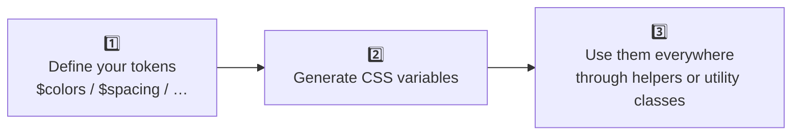

# TailorDS: Your Design System, Your Rules

There are many "ready-to-use" libraries and frameworks, like Tailwind CSS, Bootstrap, or Shadcn UI. They're fast and efficient tools: with minor adjustments, you can have a functional result in very little time.

But that speed comes at a cost: it forces you to adapt to their rules, their philosophy, and their limitations. What you gain in velocity, you lose in customization capability and unique identity. The more predefined everything is, the less room there is for creativity, attention to detail, and differentiation.

For many projects, that compromise is sufficient. But if your vision is more ambitious—if your product requires a level of customization and attention to detail that prefabricated solutions can't offer—you need something different.

This is where **TailorDS** was born: a tool for those who don't accept mass-produced design and prefer to create a unique, custom system without compromises.

## The TailorDS Philosophy

Imagine you need a suit. You could go to a store and buy one off the rack. You'd probably find your size, a design and color you like, and with some minor alterations it would fit well. It's quick and economical, but you'd be limited to their models and, let's be honest, you'd be wearing the same suit as many other people. That's what traditional frameworks are like.

Now, think about a **custom-tailored suit**. Here, you decide every detail: the design, the materials, every adjustment is made with millimeter precision. It's a more artisanal process, takes more time, but the result is a garment designed exclusively for you, that satisfies each of your requirements without compromises. It's unique.

With TailorDS, we want you to be the craftsperson. We don't do the work for you, but we give you the methodology, the rules, and the tools to build your Design System better, faster, and without errors.

## What is TailorDS

TailorDS is a library of tools and patterns designed to help you **build your own Design System** from scratch.

**TailorDS is NOT:**

- A Design System with UI components
- A template with predefined components
- A direct alternative to Tailwind CSS or Bootstrap
- A framework with fixed rules

**TailorDS IS:**

- A set of tools for creating your own Design System
- A flexible system for defining and managing your own design tokens
- A methodology that allows you to work with your own rules
- A facilitator for maintaining consistency without sacrificing customization

Our approach is clear: **empowering the creation of unique, custom Design Systems.** For us, this means total freedom in design and implementation, without compromises, and with the guarantee that your product will have its own design that won't look like thousands of others that have used the same frameworks.

TailorDS doesn't make decisions for you: **you define the rules, we give you the tools.**

## Who TailorDS is For

TailorDS is for anyone who shares the philosophy of doing things right: caring for every detail and not settling for "mass-produced" design.

- **For designers:** Offers the freedom to translate their visual decisions exactly as they've conceived them, without being constrained by the technical or methodological limitations of a framework.

- **For developers:** Provides a coherent set of tools—variables, utilities, mixins, and functions—that facilitate the implementation and maintenance of the Design System, ensuring consistency and avoiding common daily errors.

- **For CTOs and stakeholders:** Ensures that brand identity remains pure and that the final product is distinctive, without resembling any other.

TailorDS is for those who seek to create a system that reflects their product's unique identity, without compromises.

## Features: Power and Flexibility

- **Unlimited flexibility:** Define your design tokens (colors, spacing, typography, etc.) with complete freedom. There are no limits on quantity, names, or structure. Unlike other frameworks, TailorDS doesn't impose how your foundations should be.

- **Single source of truth:** Automatically generates CSS variables from your tokens. This ensures that all styles start from a single source of truth and maintain consistency. Additionally, their values can be updated at runtime, allowing you to modify themes, adapt your design, or respond to screen size.

- **Type-safe functions and mixins:** Provides SCSS functions and mixins that guarantee the use of defined tokens, avoiding invalid or hardcoded values. This way, all styles are linked to CSS variables, improving consistency and maintainability.

- **Customizable utility classes:** Generates utility classes based on your tokens, with granular control over which ones to generate. This allows you to reduce stylesheet size and define the naming conventions you prefer (for example `.margin-bottom-double`, `.mb2`, `.mb--xl`)

- **Methodology tailored to you:** TailorDS is methodology-agnostic. It allows you to develop with the approach you prefer: utility-first (like Tailwind), component-specific classes, Atomic Design, or hybrid methodologies. Whatever your workflow, TailorDS adapts to it without imposing a specific paradigm. **"Your framework, your rules."**

- **Frontend stack independence:** Being developed for CSS/SCSS, TailorDS integrates seamlessly with any frontend framework (React, Vue, Svelte, etc.).

## How TailorDS Works

TailorDS follows a three-step process to ensure consistency and flexibility for creating your own Design System:



1. **Define your tokens:** Start by creating your design tokens (for example, colors, typography, spacing). You have complete freedom to name and structure them in the way that best fits your product's needs.
2. **Generate CSS variables:** TailorDS automatically converts your tokens into CSS variables, which will be used as a single source of truth for your design system.
3. **Develop with helpers and utility classes:** Use the utility classes, mixins, and functions generated by TailorDS to apply your tokens throughout your application. These tools ensure that only valid tokens are used, maintaining consistency and avoiding "magic" values, while leveraging the power of CSS variables.

```scss
// Step 1: Define
$colors: (
  primary: #3b82f6,
  danger: #ef4444,
);

// Step 2: Automatically generated
:root {
  --color-primary: #3b82f6;
}

// Step 3: You use
.button {
  background: color("primary");
}
```

## Roadmap

TailorDS will continue evolving as a complete ecosystem for designing, maintaining, and documenting Design Systems. These are some of the tools planned in our roadmap:

- **VitePress theme:** A VitePress theme with basic components to showcase defined tokens (for example, color palettes, typographic scales, spacing units) and live examples, to show tokens in action, with code examples and document the system clearly and visually.
- **Additional tools**: Tools like a color palette generator, typographic scale creator, and other utilities are planned to streamline the creation of design system foundations.
- **Design systems guide**: A step-by-step guide for creating a Design System from scratch with TailorDS, with tips and best practices.
